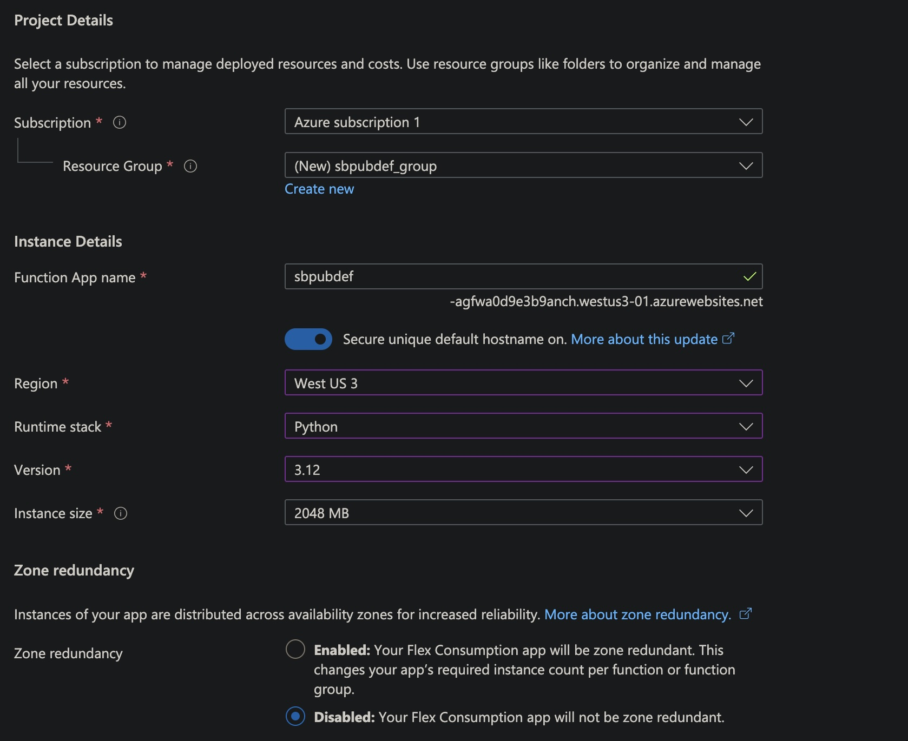
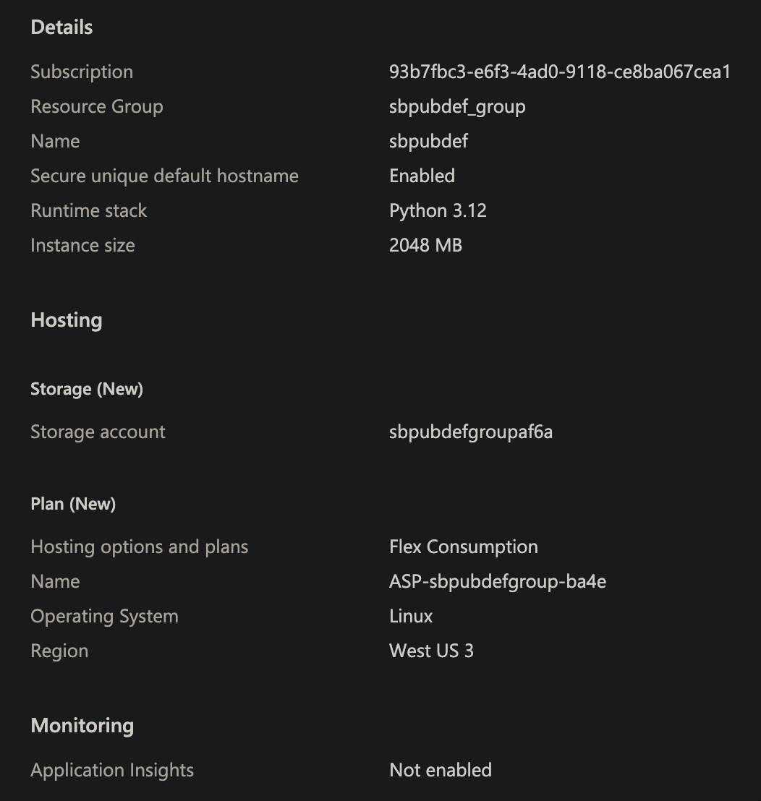
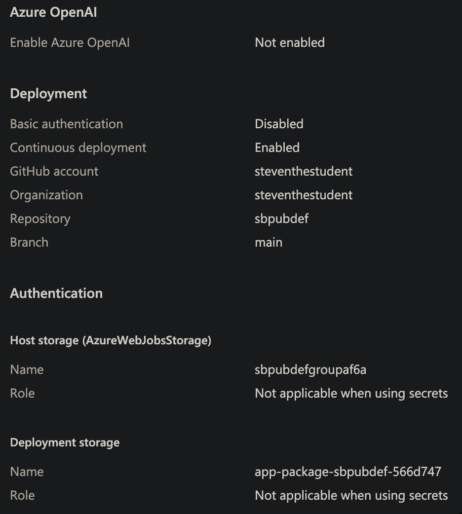
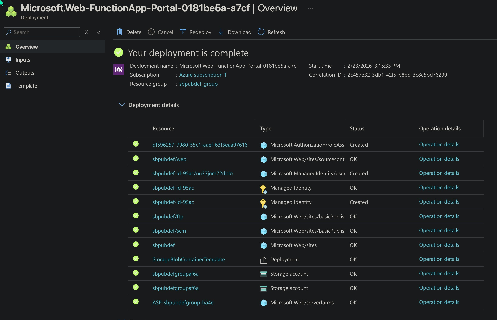
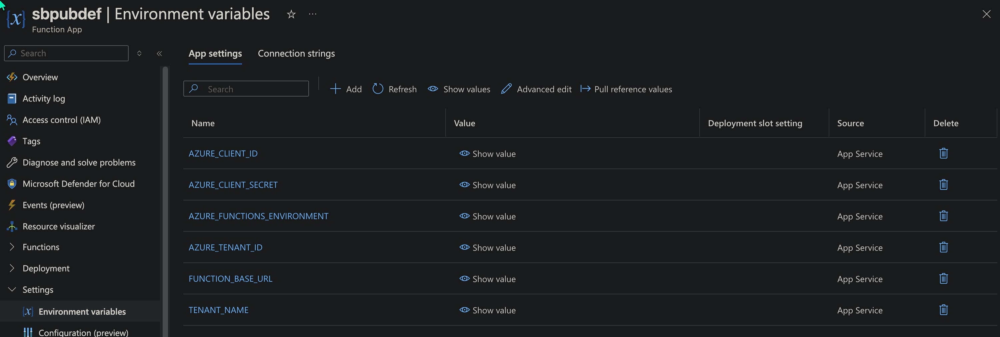
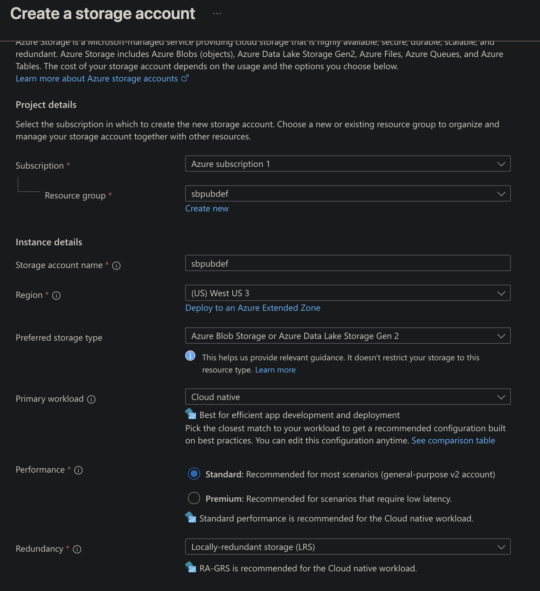
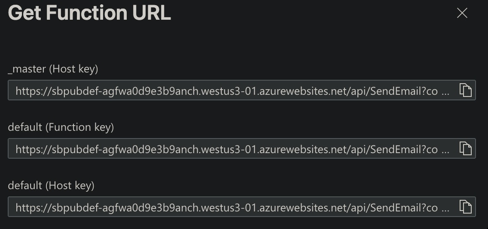

# azure functions

0. make azure free account (1million free azure function runs), i tried updating to 'pay as you go' subscription because the function would 401 if i didn't restart it often.  
   1, ~~choose consumption function~~ (flex consumption recommended if needed faster execution, but more $$$)  
   
1. use continuous deployment and modify AZURE_FUNCTIONAPP_PACKAGE_PATH to 'scripts/py/sbpubdef/azure_function' (in .github/ workflow file (github action))

details/summary:  
  
  
i had to try West US 3 (it gave error about quotas with 'West US').  
  
you've created 'Function App' (holding many azure function)

install azure function core tools (for local dev):  
[https://learn.microsoft.com/en-us/azure/azure-functions/functions-run-local?tabs=macos%2Cisolated-process%2Cnode-v4%2Cpython-v2%2Chttp-trigger%2Ccontainer-apps&pivots=programming-language-python](https://learn.microsoft.com/en-us/azure/azure-functions/functions-run-local?tabs=macos%2Cisolated-process%2Cnode-v4%2Cpython-v2%2Chttp-trigger%2Ccontainer-apps&pivots=programming-language-python)

cd into AZURE_FUNCTIONAPP_PACKAGE_PATH:

```
echo '{"version": "2.0"}' >> host.json

# and ensure azure function folder has function.json

kill -9 $(lsof -t -i:7071) && func start --verbose # restart dev server

# test
curl -i -X POST http://localhost:7071/api/SendEmail \
  -H "Content-Type: application/json" \
  -d '{"to_email":"sgonzales@csproject25.onmicrosoft.com","subject":"hello?","body":"my body"}'

```

# create mailbox to send from on behalf of the organization/app registration

you can also choose any user email: e.g. [sgonzales@csproject25.onmicrosoft.com](mailto:sgonzales@csproject25.onmicrosoft.com)  
... but we'll make one (Create a dedicated “service account” mailbox)

```
sbpubdef@csproject25.onmicrosoft.com

```

In Microsoft 365 admin center:

- **++Users → Active users → Add a user++** (for a user mailbox/service account)
- **~~Teams & groups → Shared mailboxes → Add a shared mailbox~~**

~~The tenant may restrict app-only mail with an **Application Access Policy** (Exchange Online). If so, you must whitelist the mailbox (or a group of mailboxes) the app is allowed to send as. This is common in locked-down tenants.~~

**++options:++** shared mailbox vs “service account” mailbox (recommended for apps)~~, or send as existing user~~  
Why **shared mailbox** is better: **No license** required (usually, under 50GB)

In Microsoft 365 admin center:

- **~~Users → Active users → Add a user~~**~~ (for a user mailbox/service account)
or~~
- **++Teams & groups → Shared mailboxes → Add a shared mailbox++**

[sbpubdef@csproject25.sharepoint.com](mailto:sbpubdef@csproject25.sharepoint.com)

# set environment variables from .env.public.dev / .env.dev @ azure portal -> Function App -> Settings -> Environment Variables


```

```

# build fails

```
working-directory: scripts/py/azure_function

```

(see current workflow .yaml)

# now if build succeeds and deploy fails do this:

missing environment variable: **AzureWebJobsStorage** **Value:** _(storage connection string)_  
You can get the connection string from: **Storage account → Security + networking -> Access keys → Connection string**  
(If you don’t already have a storage account, create one first.)  


# fix packages not included in build .zip (module not found error)

replace pip install in workflow .yaml _build_ job:

```
pip install --target="./.python_packages/lib/site-packages" -r requirements.txt

```

or try: cd scripts/py/azure_function && func azure functionapp publish SendEmail --build remote

## 3️⃣ Important: CORS

Before SPFx can call it from the browser, you must configure CORS.  
Go to: Azure Portal → Function App → API -> **CORS,** and add:

```
https://csproject25.sharepoint.com
https://localhost:4321

```

Otherwise the browser will block the call even if the function works.

# new function: SendEmail

### scripts/py/azure_function/SendEmail/**init**.py

```
import json
import logging
import azure.functions as func

def main(req: func.HttpRequest) -> func.HttpResponse:
    logging.info("HTTP trigger function processed a request.")
    return func.HttpResponse(json.dumps({"success": True}), mimetype="application/json")

```

### scripts/py/azure_function/SendEmail/function.json

```
{
	"scriptFile": "__init__.py",
	"bindings": [
		{
			"authLevel": "function",
			"type": "httpTrigger",
			"direction": "in",
			"name": "req",
			"methods": ["post"]
		},
		{
			"type": "http",
			"direction": "out",
			"name": "$return"
		}
	]
}

```

requires app registration w/ admin consent for Mail.send

add to script/spy/requirements.txt: ~~sendgrid~~  
 azure-functions

# using function's

go to function app -> function ->  
  
  
choose (Function key), add to add to config/.env.public

### send an email works!

```
curl -i -X POST "https://sbpubdef-agfwa0d9e3b9anch.westus3-01.azurewebsites.net/api/SendEmail?code=<function key>" \
  -H "Content-Type: application/json" \
  -d '{"to_email":"sgonzales@csproject25.onmicrosoft.com","subject":"test (subject)","body":"test (body)"}'

```

note: if u can't see the invocation or see HTTP 401 Unauthorized try restarting the Function App

# using authentication

**note:** we probably shouldn't expose Function key to spfx... so use auth instead

# Authentication: Entra ID auth + spfx AadHttpClient:
### new app registration (azure_functions) (just to link to 'Expose An API'... the Azure Function App itself will use the other app registration w/ more consent)
- 

## Entra app registration
1. **[Expose an API](https://entra.microsoft.com/?l=en.en-us#view/Microsoft_AAD_RegisteredApps/ApplicationMenuBlade/~/ProtectAnAPI/appId/dabe112a-d320-4a46-99ec-f2f990039393/isMSAApp~/false)** → set **Application ID URI** to:
* api://<CLIENT_ID> (easy, unique)
1. Add a scope:
* **Scope name:** access_as_entra_user
* **Who can consent:** Admins and users (since it’s your tenant)
* **Admin consent display name:** “Access sbpubdef API”
*   
  This gives SPFx something to request tokens for.  
  You’ll still be able to use curl — you just won’t be able to call it w/ only function key. With Entra ID auth, curl needs a **Bearer token**:  
  ?code=<functionKey> (secret in URL)     -->    Authorization: Bearer <access_token>

### allow sharepoint past 403 error
authentication -> Identity Provider -> Allowed client applications -> Add a client application: 08e18876-6177-487e-b8b5-cf950c1e598c  
this is the 'key / bearer's azp claim'

### ~~allow azure cli~~
~~app registration -> azure_functions | Expose an API -> Authorized client applications -> Add a client application: 04b07795-8ddb-461a-bbee-02f9e1bf7b46~~
```
# token for your API (recommended once you expose an API scope)
TOKEN=$(az account get-access-token --resource api://<YOUR-FUNCTION-APP-CLIENT-ID> --query accessToken -o tsv)

curl -i -X POST "https://<yourfunc>.azurewebsites.net/api/SendEmail" \
  -H "Authorization: Bearer $TOKEN" \
  -H "Content-Type: application/json" \
  -d '{"to_email":"you@csproject25.onmicrosoft.com","subject":"hi","body":"from curl"}'

```
[install azure cli](https://learn.microsoft.com/en-us/cli/azure/?view=azure-cli-latest)

## Step 2 — Turn on Authentication (Easy Auth) on the Function App
Azure Portal → Function App (**sbpubdef**) → **Authentication** → **Add identity provider** → **Microsoft**.
* **App registration:** select **azure_functions**
* options: **any signed-in tenant user** / ~~specific users/groups~~
* **Require authentication:** **On**
* Allow requests from specific client applications (list of client/app id's (leave blank))  
  After this, requests without a valid Entra token never reach your function code.

## Step 3 — Configure SPFx permissions to your API
In your SPFx solution config/package-solution.json add:
```
"webApiPermissionRequests": [
  {
    "resource": "<YOUR-azure_functions-CLIENT-ID>",
    "scope": "access_as_user"
  }
]

```
* pnpm run make -> Upload to App Catalog -> In SharePoint Admin Center → **API access**, approve the pending request

## Step 4 — Call your Function from SPFx using AadHttpClient (no keys, no CORS pain)
Use AadHttpClient instead of fetch. Example:
```
import { AadHttpClient } from '@microsoft/sp-http';

const apiBase = "https://sbpubdef-agfwa0d9e3b9anch.westus3-01.azurewebsites.net";

const client = await this.context.aadHttpClientFactory.getClient(
  "api://<YOUR-azure_functions-CLIENT-ID>"
);

const response = await client.post(
  `${apiBase}/api/SendEmail`,
  AadHttpClient.configurations.v1,
  {
    headers: { "Content-Type": "application/json" },
    body: JSON.stringify({
      to_email: [userEmail],
      subject: `Hoteling Reminder: ${reservation.location}`,
      body: "<p>...</p>",
      content_type: "HTML"
    })
  }
);

```

## Step 5 — Update Function authLevel
Once EasyAuth is on, set your function to:
```
"authLevel": "anonymous"

```
Why: you’re no longer using function keys for security; EasyAuth is the security boundary. Keeping function auth just adds a second “key” layer you don’t want to ship. (This is a common pattern when fronting Functions with platform auth.)  
