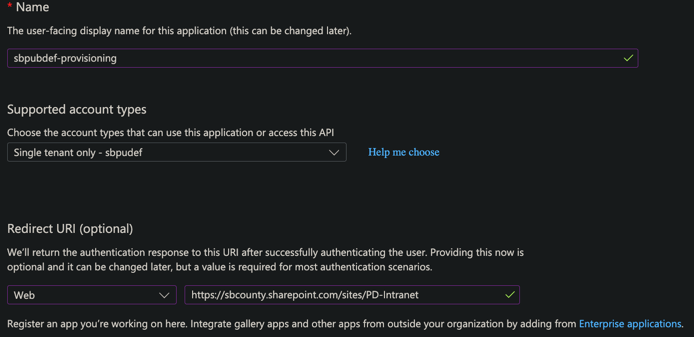

# transfer of work

  
1. Choose m365 business premium (has **feature complete** Entra ID  —needed in order to define *role groups* for Azure Function's), (not yet configured, see: [Securing Azure Functions.md](../azure%20functions/securing%20azure%20functions.md)  
2. optional _CSLA Dev Project_ teams group:  add in **Active teams and groups** [https://admin.cloud.microsoft/?trysignin=0#/groups](https://admin.cloud.microsoft/?trysignin=0#/groups)  
3. Create New Communication Site: PD Intranet
   1. **Site Settings:** /sites/PD-Intranet/_layouts/15/settings.aspx  
      1. ...  
   2. **optional:**  make it a hub (if you want extra top bar of nav links / site collection associations), **note that:** after installing solution, _ThemeInjector_  hides it)
4. Recreate ([Entra](https://entra.microsoft.com/#view/Microsoft_AAD_RegisteredApps/ApplicationsListBlade/quickStartType~/null/sourceType/Microsoft_AAD_IAM)) app registrations:

   **4.1 sbpubdef-provisioning** (migration / provisioning automation; least privilege)

   1. 
   2. **Certificates & secrets** → add a client secret → copy the value once.
   3. **API permissions** → **Microsoft Graph** → add **Application** permission **`Sites.Selected`** 
      4. **Grant admin consent** for the tenant (from _Enterprise Apps_).
   4. **Grant this app access to the PD Intranet site collection** (required for `Sites.Selected` to do anything):
      1. As a site admin (or Global/SharePoint admin), get the **site collection id**, e.g. open  
         `https://<tenant>.sharepoint.com/sites/PD-Intranet/_api/site/id`  
      2. Call Microsoft Graph (Graph Explorer as admin):  
         `POST https://graph.microsoft.com/v1.0/sites/{siteCollectionId}/permissions`  
         with a JSON body that grants **sbpubdef-provisioning**’s Application (client) ID a role of **`write`** (try first) or **`owner`** if you hit permission errors. See [Darwin Droll — Sites.Selected](https://www.darwindroll.com/blog/use-sitesselected-application-permission-in-microsoft-graph)
   5. **Env files**:
      1.  set `AZURE_TENANT_ID`, `AZURE_CLIENT_ID` / `AZURE_CLIENT_SECRET`, `TENANT_NAME` 
         2. config/ `.env.example` → `.env.dev` or `.env.prod`
         2. For migration import: `.env.migration.target.example` → `.env.migration.target`
            3. set  `MIGRATION_TARGET_SITE_NAME`. (assuming you already ran `run_full_export.py`) Details: [scripts/py/migration/target_app_registration.md](../../scripts/py/migration/target_app_registration.md).

   **4.2 Run full import on the new tenant** (after the site exists and the grant above succeeds)

   1. Confirm the communication site URL matches `MIGRATION_TARGET_SITE_NAME` / hub name you use in app config.
   2. `py scripts/py/migration/run_full_import.py`  
   3. Mid-run, the script stops for a **manual** step: build and upload the SPFx `.sppkg` to the **target** app catalog (`pnpm run make`, then SharePoint admin) before web parts can resolve.

   **4.3 sbpubdef-EasyAuth**

   - Azure Functions authentication / API app registration (Graph `Mail.Send`, `Calendars.ReadWrite`, etc. as needed—**not** on sbpubdef-provisioning).

- update config/
    - .env.public.prod
    - .env.prod
    - package-solution.json
        - webApiPermissionRequests from app registration: Application (client) ID + scope name
    - scripts/py/azure_function
        - set AZURE_FUNCTIONS_ENVIRONMENT to any value to ensure they use production
    - scripts/js (gen-env)
        - ensure that process.env.NODE_ENV === "production"

  
# Entra ID -> Groups -> Security Groups  

| displayName | id | groupType | membershipType | mail | source | mailEnabled | onPremisesSyncEnabled |
| ----------------- | ------------------------------------ | --------- | -------------- | ---- | ------ | ----------- | --------------------- |
| Attorney | f9e66388-efe6-4b94-811c-a0890a51ea73 | Security | assigned |  | Cloud | False |  |
| CDD | f16e8da5-04df-4d3e-93f2-400752a4ab14 | Security | assigned |  | Cloud | False |  |
| ComplianceOfficer | f7262977-8900-4b64-99e1-378db87fcf35 | Security | assigned |  | Cloud | False |  |
| HR | 26a2d26f-8019-4285-b682-90e491d77049 | Security | assigned |  | Cloud | False |  |
| IT | bb27ef32-d7fe-4ed5-81b8-b6237098d6aa | Security | assigned |  | Cloud | False |  |
| LOP | cc440ce9-6b0d-4ee0-bc18-1e8f65d498f9 | Security | assigned |  | Cloud | False |  |
| PDIntranet | 1a4bac58-bfe9-4ca5-9ed5-50b5d77c572c | Security | assigned |  | Cloud | False |  |
| TrialSupervisor | 8d69c597-971c-4c64-b7cb-a8078ab78d9f | Security | assigned |  | Cloud | False |  |
  
Security Groups csv export. Recreate these with (onPremisesSyncEnabled) or update *.public.env.dev* ROLE_ keys with equivalent on-prem group  (displayName)  
  
# invited users: Entra ID change guest to Microsoft Fabric (free) then optionally: after they access site once, change back to guest  
  
PortalCalendar uses 1 SharePoint calendar (and it reads from outlook calendar as well)  
****to add an entire SharePoint calendar to outlook: Site Contents ->  Events -> Calendar (top ribbon bar)****  
  
troubleshoot  
... you may want additional calendars so the user can choose which to subscribe to.  e.g.: 1 per department, + an Assignments calendar, etc.
