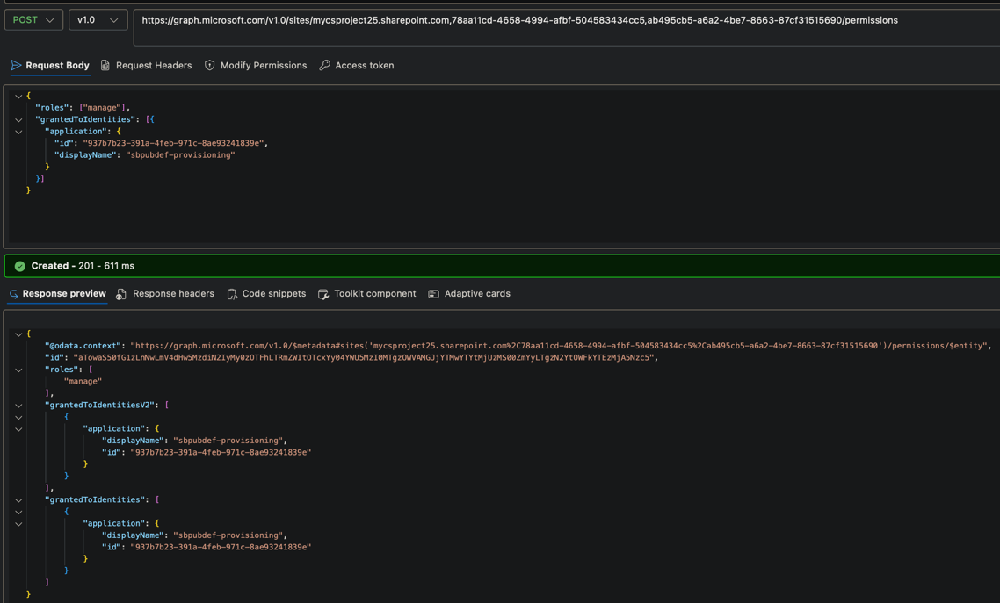
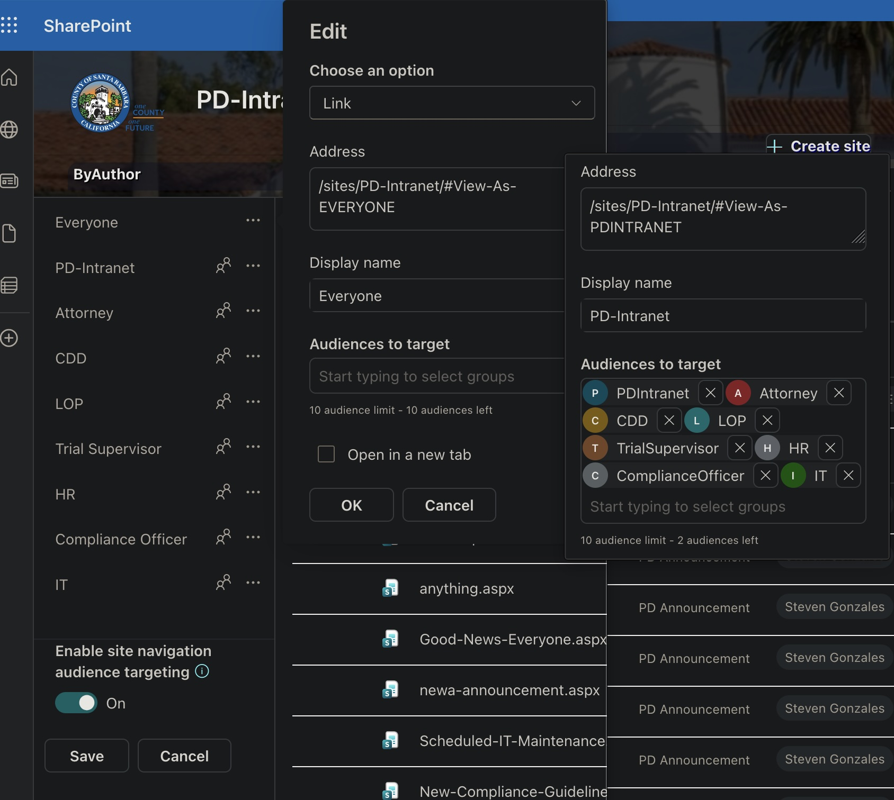
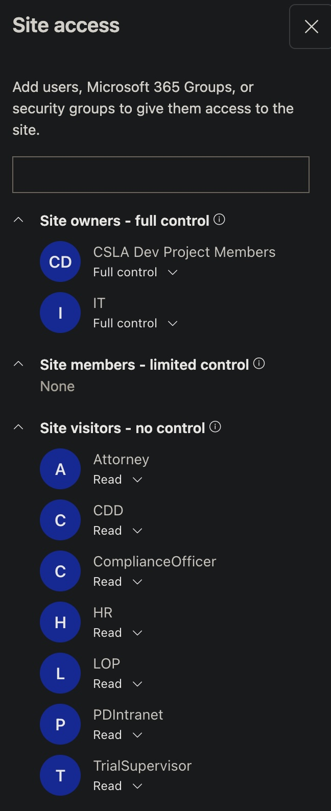

# transfer of work

0. for production: you will edit `.env.public.prod` & `.env.prod` (save `.env.public.dev` as `.env.public.prod`)
0. Choose m365 business premium (has **feature complete** Entra ID  —needed in order to define *role groups* for Azure Function's), (not yet configured, see: [Securing Azure Functions.md](../azure%20functions/securing%20azure%20functions.md)  
2. optional _CSLA Dev Project_ teams group:  add in **Active teams and groups** [https://admin.cloud.microsoft/?trysignin=0#/groups](https://admin.cloud.microsoft/?trysignin=0#/groups)  
3. Create New Communication Site: PD Intranet
   1. **optional:**  make it a hub (if you want extra top bar of nav links / site collection associations), **note that:** after installing solution, _ThemeInjector_  hides it)
4. Recreate ([Entra](https://entra.microsoft.com/#view/Microsoft_AAD_RegisteredApps/ApplicationsListBlade/quickStartType~/null/sourceType/Microsoft_AAD_IAM)) app registrations:

   **4.1 sbpubdef-provisioning** (migration / provisioning automation; least privilege)

   1. 
   2. **Certificates & secrets** → add a client secret → copy the value once.
   3. **API permissions** → **Microsoft Graph** → add **Application** permission **`Sites.Selected`** 
      4. **Grant admin consent** for the tenant (from _Enterprise Apps_).
   4. **Grant this app access to the PD Intranet site collection** (required for `Sites.Selected` to do anything):
      1. GET comma-separated site collection id from `https://graph.microsoft.com/v1.0/sites/<tenant>.sharepoint.com:/sites/PD-Intranet`
      2. Call Microsoft Graph (Graph Explorer with `Sites.ReadWrite.All` / `Sites.FullControl.All` / `Sites.Manage.All`):  
         `POST https://graph.microsoft.com/v1.0/sites/{siteCollectionId}/permissions`  
         with a JSON body that grants **sbpubdef-provisioning**’s Application (client) ID a role of **`manage`**
      
   5. **Env files**:
      1. config/ `.env.example` → `.env.dev` or `.env.prod`
         1.  set `AZURE_TENANT_ID`, `AZURE_CLIENT_ID` / `AZURE_CLIENT_SECRET`
         2. in the public env file, update `TENANT_NAME` 
         2. For migration import: `.env.migration.target.example` → `.env.migration.target`
            3. set  `MIGRATION_TARGET_SITE_NAME`. (assuming you already ran `run_full_export.py`) Details: [scripts/py/migration/target_app_registration.md](../../scripts/py/migration/target_app_registration.md).

   **4.2 Run full import on the new tenant** (after the site exists and the grant above succeeds)

   2. `py scripts/py/migration/run_full_import.py`  
   3. Mid-run, the script stops for a **manual** step: build and upload the SPFx `.sppkg` to the **target** app catalog (`pnpm run make`, then SharePoint admin: approve requested advanced->api permissions) before web parts can resolve.

   **4.3 sbpubdef-EasyAuth**

   - Azure Functions authentication / API app registration used for **incoming** auth (EasyAuth / `AadHttpClient`). This is separate from the daemon/app-only app.


&nbsp;

- `config/`
    - package-solution.json
        - webApiPermissionRequests from app registration: Application (client) ID + scope name


### to ensure production environment is used:
  - scripts/py/azure_function
      - set AZURE_FUNCTIONS_ENVIRONMENT to any value to ensure they use production
  - scripts/js (gen-env)
      - ensure that process.env.NODE_ENV === "production"

migration scripts
run_full_export uses .env.dev
- .migration_output
   - content types (PD Form List, PD Announcement, PD Events)
   - columns (PDDepartment)
   - site pages
   - lists
   - document libraries
     run_full_import uses .env.migration.target and .migration_output

https://mycsproject25.sharepoint.com/sites/PD-Intranet/_layouts/15/ctypenew.aspx
new content type: PD Announcement (Document Content Types, Site Page)

Add from new site column: PDDepartment (Choice (menu to choose from) w/ ROLE_ keys (EVERYONE, PDINTRANET, IT, HR, ...))

... PD Events, PD Form List (should be created via import script(s))

Announcements webpart uses hub search to list results, so none display until you configure mapped property (MP):

https://csproject25-admin.sharepoint.com/_layouts/15/searchadmin/ta_listmanagedproperties.aspx?level=tenant
New Managed Property: PDDepartment Text	-	Query	Search	Retrieve	-	-	Safe	OWS_Q_CHCS_PDDEPARTMENT
- searchable, queryable, retrievable, allow multiple values, safe for anonymous
- mapping to crawled property: ows_q_CHCS_PDDepartment

then in Crawled Properties:
- ows_PD_x0020_Department (Mapped To Property: empty/null)
- ows_q_CHCS_PDDepartment (Mapped To Property: PDDepartment )
  reindex the site (from List Settings), reindex Site Pages document library (Settings -> Advanced settings)... then ows_q_CHCS_PDDepartment (crawled property) will appear, and you can map it to the MP

Enable PD Announcement content type for Site Pages (Library Settings)

upload spfx package
- set .env.migration.target MIGRATION_SPFX_DEPLOYED=true
- approve pending (`admin-<tenant>.sharepoint.com` -> advanced -> api):
   - fix access_as_entra_user `The requested permission isn't valid. Reject this request and contact the developer to fix the problem and redeploy the solution.`
      - aligned with azure functions (FUNCTION_API_APP_ID) (for EasyAuth authentication) `"resource": "<YOUR-azure_functions-CLIENT-ID>",` (package-solution)

follow [azure_functions.md](docs/azure_functions/azure_functions.md) for in-depth azure function setup.
- use `python3 patch_azure_function_environment.py azure_function_environment.json` to quickly patch exported environment variables w/ env files.

reupload/reapprove pending

run_full_import.py (use flag: --skip-library-uploads  —if need to rerun / avoid reupload)

Navigation


  
# Entra ID -> Groups -> Security Groups  

| displayName | id | groupType | membershipType | mail | source | mailEnabled | onPremisesSyncEnabled |
| ----------------- | ------------------------------------ | --------- | -------------- | ---- | ------ | ----------- | --------------------- |
| Attorney | f9e66388-efe6-4b94-811c-a0890a51ea73 | Security | assigned |  | Cloud | False |  |
| CDD | f16e8da5-04df-4d3e-93f2-400752a4ab14 | Security | assigned |  | Cloud | False |  |
| ComplianceOfficer | f7262977-8900-4b64-99e1-378db87fcf35 | Security | assigned |  | Cloud | False |  |
| HR | 26a2d26f-8019-4285-b682-90e491d77049 | Security | assigned |  | Cloud | False |  |
| IT | bb27ef32-d7fe-4ed5-81b8-b6237098d6aa | Security | assigned |  | Cloud | False |  |
| LOP | cc440ce9-6b0d-4ee0-bc18-1e8f65d498f9 | Security | assigned |  | Cloud | False |  |
| PDIntranet | 1a4bac58-bfe9-4ca5-9ed5-50b5d77c572c | Security | assigned |  | Cloud | False |  |
| TrialSupervisor | 8d69c597-971c-4c64-b7cb-a8078ab78d9f | Security | assigned |  | Cloud | False |  |
  
Security Groups csv export. Recreate these with (onPremisesSyncEnabled) or update *.public.env.dev* ROLE_ keys with equivalent on-prem group  (displayName)  
  


# invited users: Entra ID change guest to Microsoft Fabric (free) then optionally: after they access site once, change back to guest  
  
PortalCalendar uses 1 SharePoint calendar (and it reads from outlook calendar as well)  
****to add an entire SharePoint calendar to outlook: Site Contents ->  Events -> Calendar (top ribbon bar)****  
  
troubleshoot  
... you may want additional calendars so the user can choose which to subscribe to.  e.g.: 1 per department, + an Assignments calendar, etc.

# **More on App Registrations: Current repo model (single daemon app):** keep app-only Graph permissions on **sbpubdef-provisioning** so local scripts + functions share the same credentials:
    - `Sites.Selected` (application) + site permission grant (required)
    - `Mail.Send` (application)
    - `Calendars.ReadWrite` (application) for creating events in staff mailboxes (PortalCalendar, Assignments, ...)
    - `User.Read.All` (application) only if you need Entra user object-id lookup (`graph_get_user_object_id`)
    
- Details: [scripts/py/migration/target_app_registration.md](../../scripts/py/migration/target_app_registration.md)

# serve.json, write-manifests.json:
ensure urls use new TENANT_NAME

# sample .env.migration.target
```
AZURE_TENANT_ID=
AZURE_CLIENT_ID=
AZURE_CLIENT_SECRET=
TENANT_NAME=mycsproject25
MIGRATION_TARGET_SITE_NAME=PD-Intranet
MIGRATION_EXPORT_DIR=scripts/py/migration/.migration_output
MIGRATION_DRY_RUN=false
MIGRATION_SPFX_DEPLOYED=true
```

# Individual list permissions (example model)

Configure each list: **List settings** → **Permissions for this list**.  
If the list should differ from the site default, **Stop inheriting permissions** first, then add the Entra security groups whose **display names** match your `ROLE_*` values in `config/.env.public.dev` / `.env.public.prod`.

The tables below are a **starting pattern**, not a legal requirement—adjust for your org. Permission levels use SharePoint’s built-in names (e.g. **Read**, **Contribute**, **Edit**); exact names can vary slightly if you use custom levels.

**`LIST_*` → SharePoint list title** (values from `.env.public.dev`; titles must match what exists on the site).

| Env key | Typical list title on site | Permissions       |
| ------- | ---------------------------- |-------------------|
| `LIST_EXPERTDIRECTORY` | Expert Directory | inherit from site |
| `LIST_STAFFDIRECTORY` | StaffDirectory | inherit from site |
| `LIST_ASSIGNMENTS` | Assignments | inherit from site |
| `LIST_ASSIGNMENTCATALOG` | AssignmentCatalog | inherit from site |
| `LIST_ASSIGNMENTSTEPS` | AssignmentSteps | inherit from site |
| `LIST_ASSIGNMENTQUIZQUESTIONS` | AssignmentQuizQuestions | inherit from site |
| `LIST_ASSIGNMENTQUIZATTEMPTS` | AssignmentQuizAttempts | inherit from site |
| `LIST_PDASSIGNMENT` | *(deprecated alias → same as Assignments)* | inherit from site |
| `LIST_PROCEDURECHECKLIST` | LOPProcedureChecklist | inherit from site |
| `LIST_PROCEDURESTEPS` | ProcedureSteps | inherit from site |
| `LIST_HOTELINGRESERVATIONS` | HotelingReservations | inherit from site |
| `LIST_SITESETTINGS` | SiteSettings | inherit from site |

